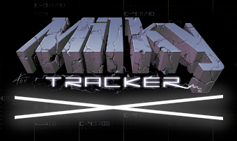

> Q: What are the differences between MilkyTrackerX and MilkyTracker?

A: MilkyTrackerX is basically a build of mainline MilkyTracker, but with **new gridsequencer-like features & UX-changes, new keyboard shortcuts, [sample-editor scripting](https://gitlab.com/coderofsalvation/milkytracker-scripts), [ASCIISTEP16 liveperforming](https://tinyurl.com/asciistep16) and different default settings** on top of it (a 'better' (opiniated) milkytracker workflow).

> Q: Why a tracker? We have DAW's which supports 1001 things'n'plugins these days.

A: Well good luck with that: 1001 things'n'plugins easily become a burden for productivity. This is where sample-trackers shine since the late 80s. 
Samples & all-in-one-screen-UX are first-class-citizens, which introduces the up/downside of stronger separation between sounddesign and composition.

### Download MilkyTrackerX:

* Linux: [MilkyTracker-x86_64.AppImage](https://ci.appveyor.com/api/projects/coderofsalvation/milkytrackerx/artifacts/milkytracker/MilkyTrackerX-x86_64.AppImage?branch=master&job=Image:%20Ubuntu1604;%20Platform:%20x64)
* Win64: [milkytracker-win64.zip](https://ci.appveyor.com/api/projects/coderofsalvation/milkytrackerx/artifacts/milkytracker/build/milkytracker-1.03.00-win64.zip?branch=master&job=Image:%20Visual%20Studio%202017;%20Platform:%20x64)
* Win32: [milkytracker-win32.zip (untested)](https://ci.appveyor.com/api/buildjobs/5od1e67fb3by6urx/artifacts/milkytracker%2Fbuild%2Fmilkytracker-1.03.00-win32.zip)
* Raspberry PI: [todo]()

### Download scripts

* [example scripts (ZIP) + info](https://gitlab.com/coderofsalvation/milkytracker-scripts) 

> NOTE #1: These are just examples, and might (not) work on your system. Sometimes scripts need external applications, so check your console for error messages.

> NOTE #2: scripts for windows usually end with `.ps1` or `.bat` 

### Video demo: soundgrain integration

### Video demo: csound integration

### Video demo: realtime / custom sampler howto 

### Video demo: dev brainstorm session

